# FCC Molecular Dynamics Simulator


A modular molecular dynamics simulator for face-centered cubic (FCC) metals written in Python with optional pybind11-based C++ acceleration for force evaluation and time integration.

This project implements classical molecular dynamics using 12-6 Lennard–Jones potentials together with modern scientific software practices including automated analysis tools, validation routines, performance benchmarking, interactive visualization, as well as a local and web-based user interface.

Designed as a scientific computing portfolio project demonstrating numerical methods, molecular dynamics, computational materials science, verification and validation, performance benchmarking, and scientific software engineering.

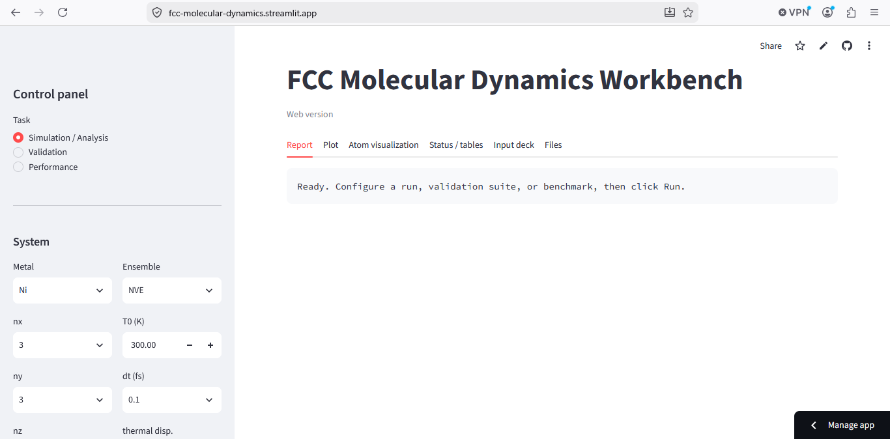

## Highlights

- Hybrid Python/C++ molecular dynamics simulator using pybind11 acceleration
- Interactive Streamlit web application and desktop GUI
- Automated analysis, validation, and performance benchmarking suites
- Publication-quality plots and OVITO-compatible trajectory export
- Modular architecture designed for computational materials science workflows

## Technologies

- Python
- NumPy
- pybind11 / C++
- Streamlit
- Plotly
- Matplotlib

---

# Features

## Molecular Dynamics

- Velocity Verlet integrator
- Verlet neighbor lists
- NVE (microcanonical) ensemble
- NVT (Berendsen thermostat)
- Periodic boundary conditions
- Minimum image convention
- Maxwell–Boltzmann velocity initialization
- Center-of-mass drift removal
- FCC lattice generation

---

## Analysis Suite

Automatically computes:

- Temperature
- Pressure
- Kinetic Energy
- Potential Energy
- Total Energy
- Radial Distribution Function (RDF)
- Mean Squared Displacement (MSD)
- Velocity Autocorrelation Function (VACF)
- Static Structure Factor S(k)
- Coordination Number (CN)
- Diffusion Coefficient (MSD)
- Diffusion Coefficient (VACF)
- Heat Capacity (Cv)

---

## Validation Suite

Built-in numerical verification & validation including:

- Energy conservation
- Momentum conservation
- Equipartition theorem
- Timestep convergence (Richardson extrapolation)
- FCC RDF peak validation
- Coordination number validation
- Temperature stability

Each validation test automatically generates publication-quality figures together with a pass/fail report.

---

## Performance Suite

Benchmark tools measure:

- Neighbor list construction
- Force computation
- Velocity Verlet integration
- Runtime scaling
- Atom-step throughput

---

## Visualization

- Interactive Streamlit web application
- Desktop GUI
- Interactive 3D Plotly visualization
- Publication-quality plots
- XYZ and NPZ trajectory export
- OVITO-compatible trajectories

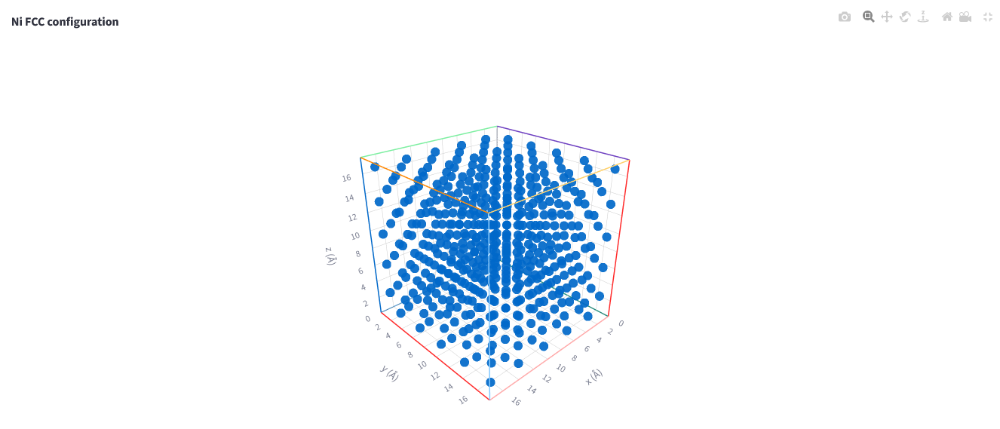

---

## Automated testing

The repository includes a comprehensive pytest suite covering the numerical core, analysis routines, scientific-validation helpers, and short end-to-end MD smoke tests. GitHub Actions runs the suite on Python 3.11, 3.12, and 3.13 for every push and pull request.

```bash
python -m pip install -r requirements-dev.txt
python -m pip install -e .
python -m pytest
python -m pytest --cov=md --cov-report=term-missing
```

See [`TESTING.md`](TESTING.md) for the test structure, markers, coverage commands, and guidance for adding new tests.

---

# Supported Metals

Current parameter sets are provided for 8 FCC metals: Ag, Al, Au, Cu, Ni, Pb, Pd, and Pt. Lattice constants, atomic masses, and Lennard–Jones parameters taken from Heinz et al. [1].

---

# Physics

The simulator integrates Newton's equations of motion

\[
m_i\frac{d^2\mathbf r_i}{dt^2}=\mathbf F_i
\]

using Velocity-Verlet time integration [2] and standard molecular dynamics algorithms described in [3,4].

Interatomic forces are computed from the 12–6 Lennard–Jones potential

\[
U(r)=4\epsilon
\left[
\left(\frac{\sigma}{r}\right)^{12}
-
\left(\frac{\sigma}{r}\right)^6
\right].
\]

Implemented algorithms include:

- periodic boundary conditions
- minimum image convention
- Verlet neighbor lists
- Berendsen thermostat
- Velocity Verlet integration

---

# Project Structure

```text
PROJECT_FCC_MD/

├── md/
│   ├── analysis/          # RDF, MSD, VACF, structure factor, transport
│   ├── validation/        # Verification & validation suite
│   ├── performance/       # Performance benchmarking
│   ├── constants.py
│   ├── lattice.py
│   ├── neighborlist.py
│   ├── forces.py
│   ├── integrator.py
│   ├── system.py
│   ├── plotting.py
│   ├── viz.py
│   ├── md_cpp.cpp         # pybind11 C++ kernels
│   └── md_cpp*.pyd        # compiled extension
│
├── outputs/               # Saved simulations, reports, figures
├── screenshots/           # README images
├── examples/              # Example driver scripts
│
├── streamlit_app.py       # Web application
├── gui.py                 # Desktop GUI
├── main.py                # Command-line interface
│
├── requirements.txt
├── setup.py
└── README.md
```

---

# Installation

Clone the repository

```bash
git clone https://github.com/yourusername/FCC-Molecular-Dynamics.git
cd FCC-Molecular-Dynamics
```

Install dependencies

```bash
pip install -r requirements.txt
```

---

# Running

## Streamlit

```bash
streamlit run streamlit_app.py
```

---

## Desktop GUI

```bash
python gui.py
```

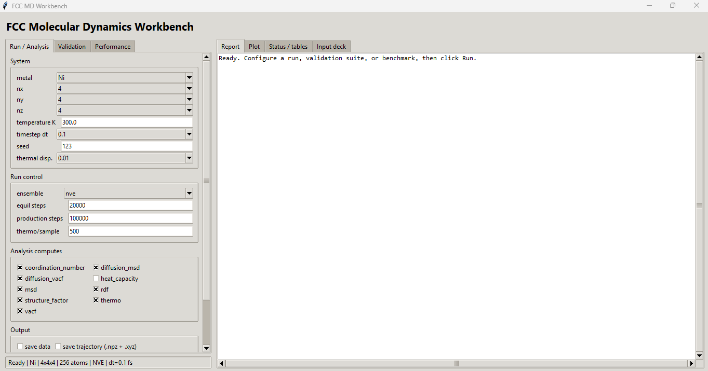

---

## Terminal

```bash
python main.py
```

---

# Analysis

The analysis suite automatically generates:

- Temperature history
- Pressure history
- Energy history
- RDF
- MSD
- VACF
- Structure factor
- Diffusion analysis
- Heat capacity
- Coordination number

Plots may be displayed interactively or saved automatically.

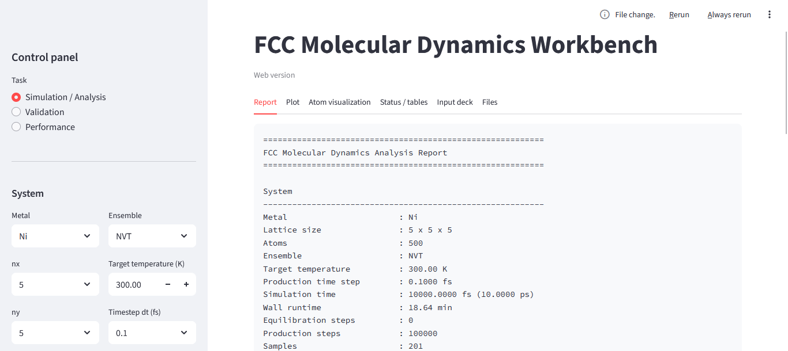

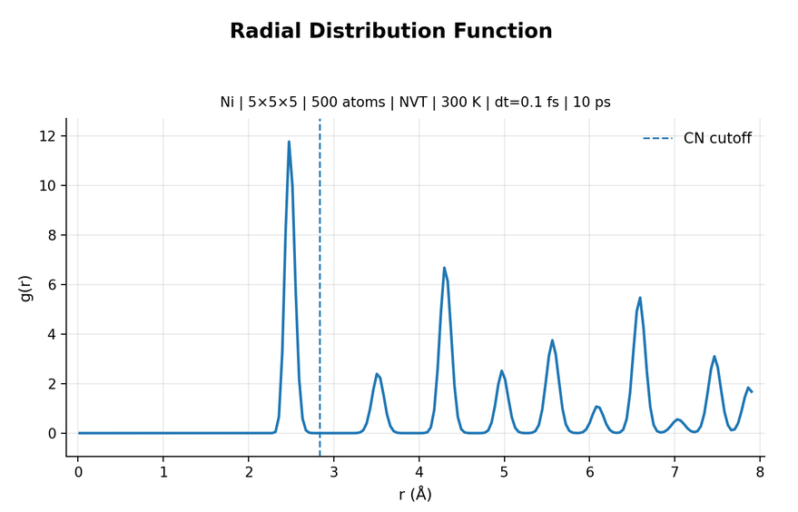

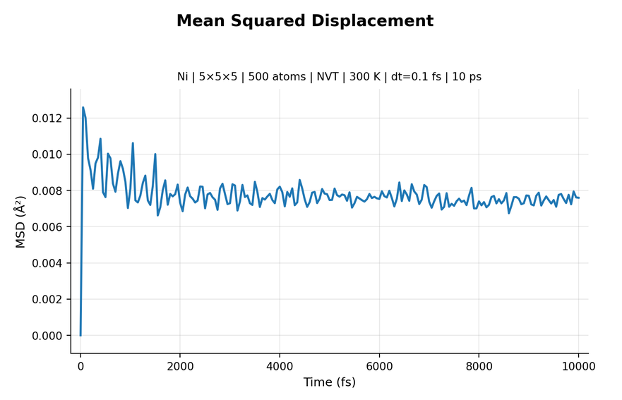

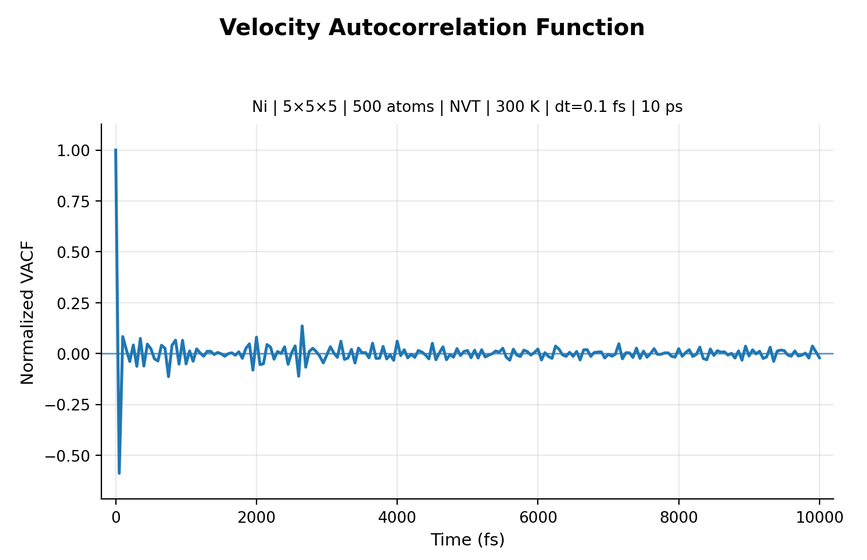


---

# Validation

The simulator includes an automated verification & validation (V&V) suite to verify both the numerical implementation and the physical correctness of the molecular dynamics simulation.

The current suite evaluates:

- Energy conservation in NVE simulations
- Linear momentum conservation
- Equipartition of kinetic energy among Cartesian (x,y,z) components
- Second-order timestep convergence using Richardson refinement
- FCC radial distribution function (RDF) peak positions
- Coordination number against the ideal FCC value (12)
- Temperature stability during NVT simulations

Each validation test produces a publication-quality figure together with a detailed pass/fail report and quantitative error metrics.

Example validation report:

```
✓ Energy Conservation

✓ Momentum Conservation

✓ Equipartition

✓ RDF Peak Positions

✓ Coordination Number

✓ Temperature Stability

✓ Time-Step Convergence
```

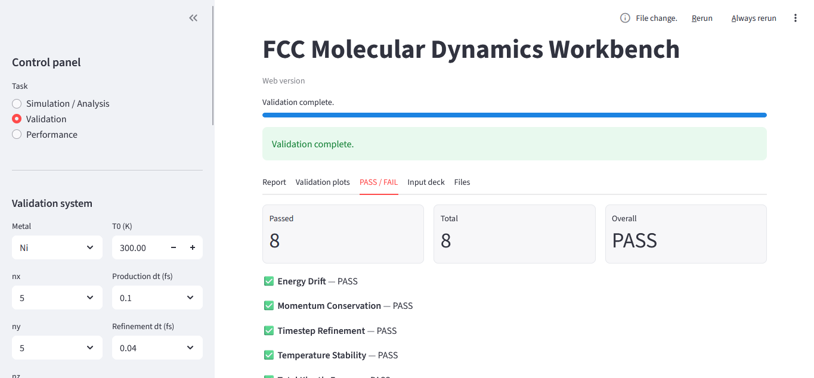

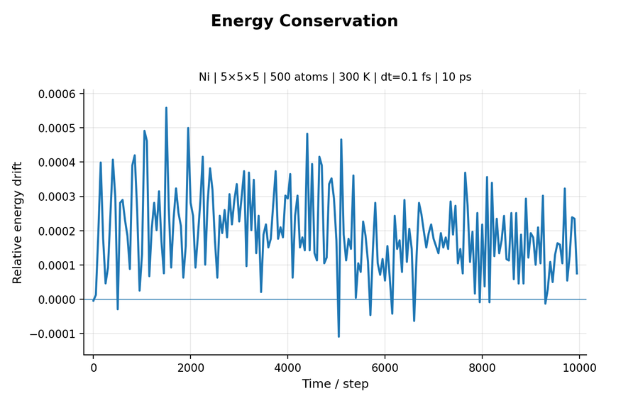

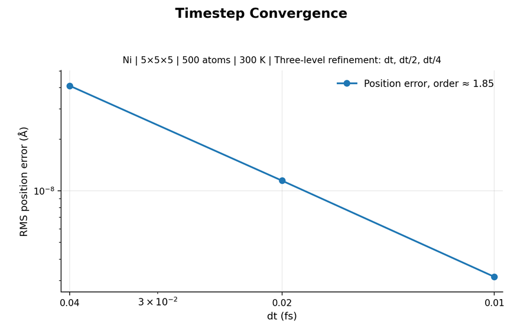

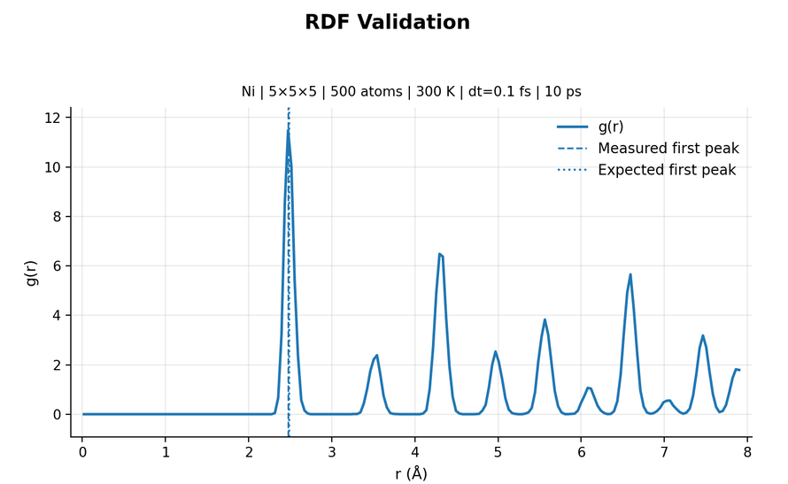


---

# Performance

The performance suite benchmarks the computational kernels of the simulator across multiple FCC system sizes. Reports include timing for neighbor-list construction, force evaluation, Velocity-Verlet integration, and overall simulation throughput.

The simulator supports both a pure Python implementation and an optional pybind11-based C++ backend for computational kernels, enabling direct performance comparisons and accelerated production runs.

Benchmark results include:

- Runtime scaling with system size
- Neighbor-list construction time
- Force evaluation time
- Velocity-Verlet integration throughput
- Atom-steps per second
- Summary performance report

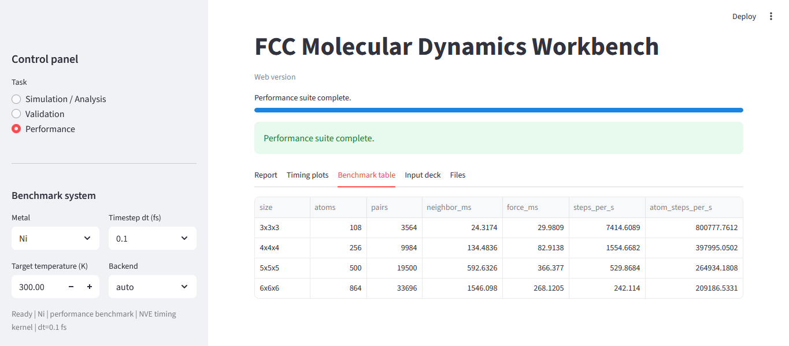

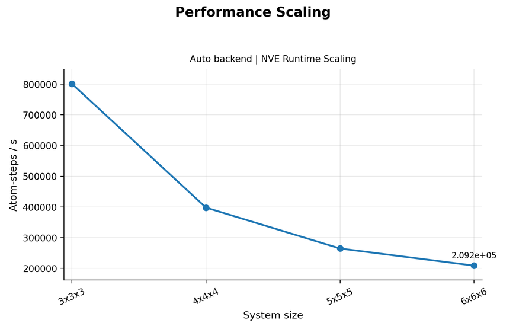

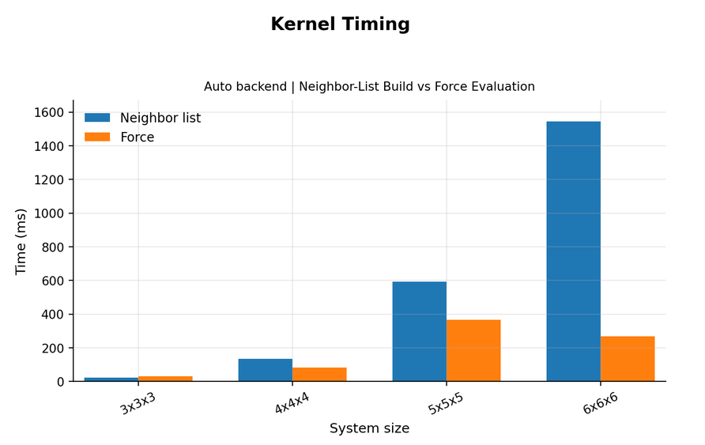


---

# Output Files

Typical simulation outputs include

```
trajectory.xyz
trajectory.npz

temperature.dat
pressure.dat
energy.dat

rdf.dat
msd.dat
vacf.dat
structure_factor.dat

analysis_report.txt
validation_report.txt
performance_report.txt

plots/
```

---

# Future Work

Potential extensions include

- Embedded Atom Method (EAM)
- Nose–Hoover thermostat
- Parrinello–Rahman barostat
- OpenMP parallelization
- GPU acceleration
- C++ force kernels
- MPI domain decomposition
- Additional crystal structures
- LAMMPS benchmark comparison

---

# Motivation

This project was developed to demonstrate modern scientific software development practices for computational materials science, including

- numerical methods
- scientific visualization
- software engineering
- verification & validation
- computational physics
- performance benchmarking

---

## References

[1] H. Heinz, R. A. Vaia, B. L. Farmer, and R. R. Naik,
Accurate simulation of surfaces and interfaces of face-centered cubic metals using
12–6 and 9–6 Lennard-Jones potentials,
J. Phys. Chem. C 112 (2008), no. 44, 17281–17290.

[2] L. Verlet,
Computer "experiments" on classical fluids. I. Thermodynamical properties of Lennard-Jones molecules,
Phys. Rev. 159 (1967), 98–103.

[3] D. Frenkel and B. Smit,
Understanding Molecular Simulation: From Algorithms to Applications,
2nd ed., Academic Press, San Diego, CA, 2002.

[4] M. P. Allen and D. J. Tildesley,
Computer Simulation of Liquids,
2nd ed., Oxford University Press, Oxford, 2017.

---

# License

MIT License.