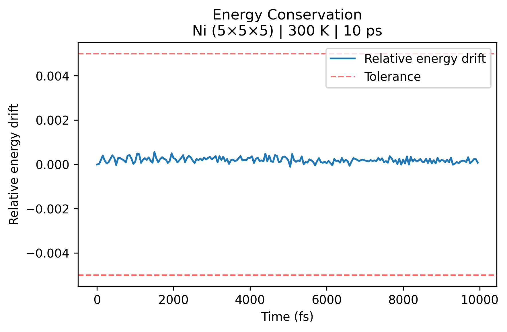
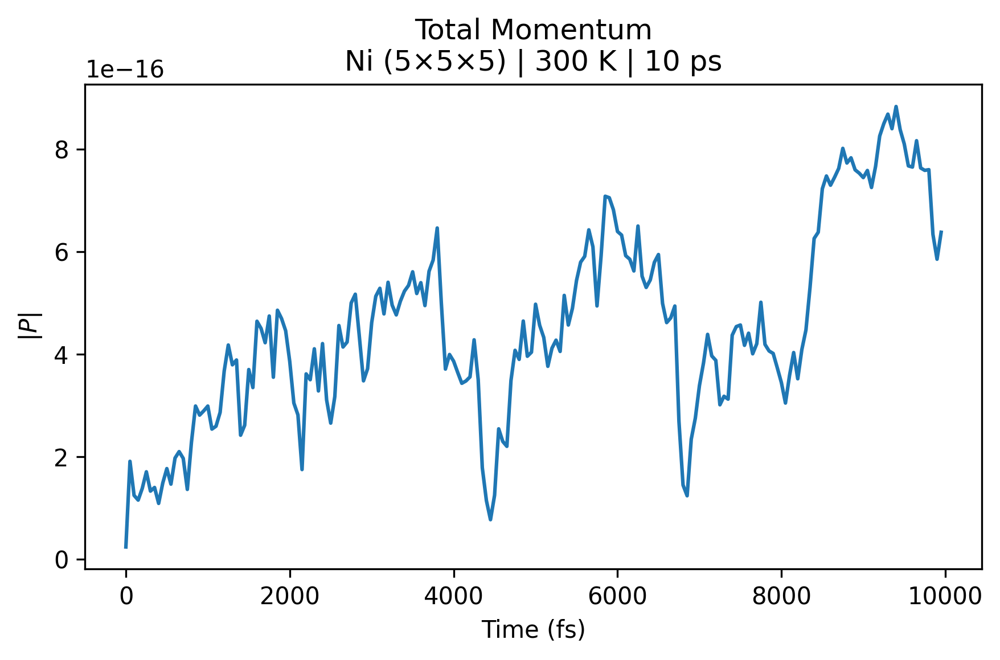
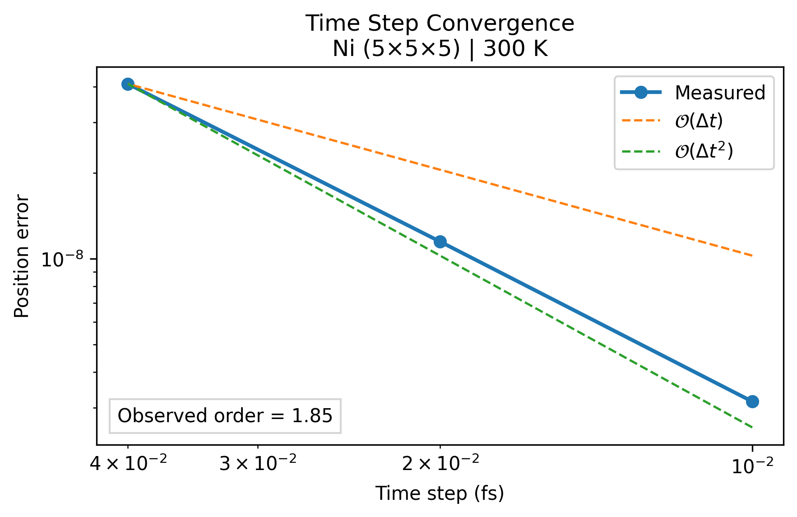
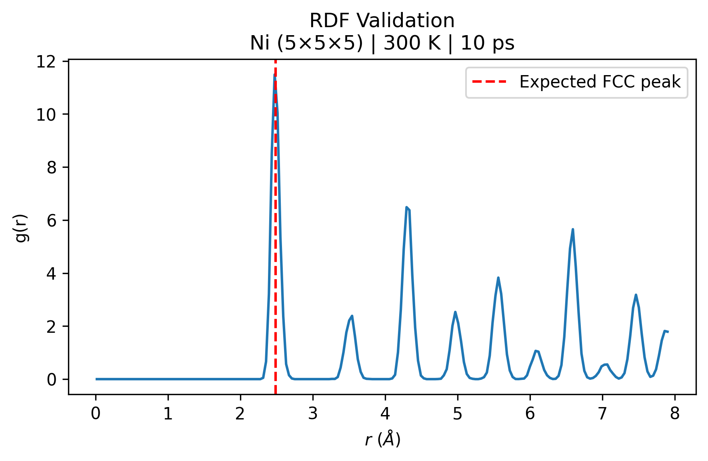
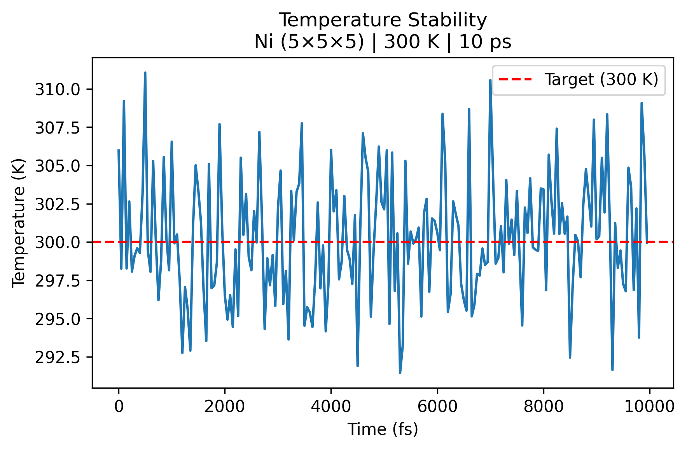
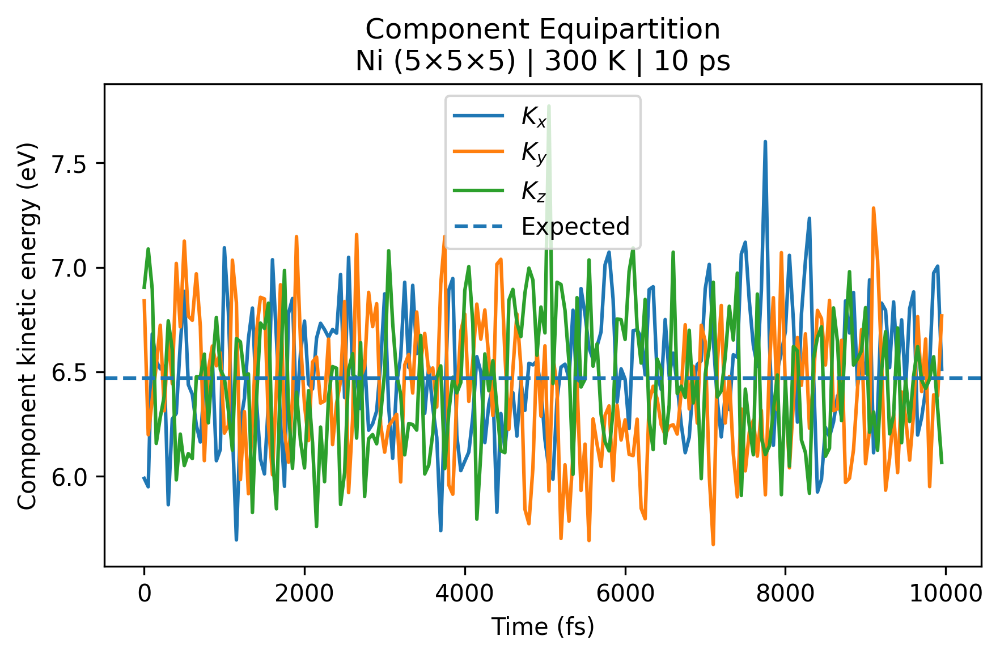

# Validation Report

**FCC Molecular Dynamics Simulator**  
**Author:** Alec D. Wendland

---

## Abstract

This report documents the numerical and physical validation of the FCC Molecular Dynamics Simulator. The simulator implements classical molecular dynamics for 8 FCC metals using the Lennard–Jones (12–6) potential, Velocity Verlet integration, periodic boundary conditions, and Verlet neighbor lists, with optional Berendsen thermostatting for NVT runs. Validation is organized around conservation tests, timestep convergence studies, structural characterization, and thermodynamic verification. The methodology follows standard references in molecular dynamics and statistical mechanics [1–4].

---

# 1. Introduction

Scientific simulation software must demonstrate both numerical correctness and physical accuracy before simulation results can be trusted. In molecular dynamics, validation commonly consists of verifying conservation laws, expected numerical convergence rates, structural observables, and thermodynamic behavior [1,2].

The automated validation suite distributed within this project evaluates each of these properties independently. The selected validation tests are consistent with those commonly employed in modern molecular dynamics software packages and the scientific literature [1–3,7]. Representative results throughout this report correspond to FCC Ni at 300 K. The complete validation suite was also executed for Ag, Al, Au, Cu, Pb, Pd, and Pt using the default simulation parameters, and all validation tests passed. Representative simulations required approximately 32 minutes on a single desktop CPU. Validation results for all supported FCC metals are included in the repository under `outputs/validation/`.

---

# 2. Molecular Dynamics Methodology

## 2.1 Equations of Motion

Particle trajectories satisfy Newton's second law

```math
m_i\frac{d^2\mathbf {r}_i}{dt^2}=\mathbf {F}_i,
```

where the total force on particle $i$ is obtained by summing pairwise interactions.

## 2.2 Lennard–Jones Potential

Atoms interact through the 12–6 Lennard–Jones potential [1–4]

```math
U(r)=4\varepsilon
\left[
\left(\frac{\sigma}{r}\right)^{12}
-
\left(\frac{\sigma}{r}\right)^6
\right].
```

The corresponding force is

```math
\mathbf {F}_{ij}
=
24\varepsilon
\left[
2\left(\frac{\sigma}{r_{ij}}\right)^{12}
-
\left(\frac{\sigma}{r_{ij}}\right)^6
\right]
\frac{\mathbf {r}_{ij}}{r_{ij}^{2}}.
```

Periodic boundary conditions together with the minimum-image convention are employed.

## 2.3 Numerical Integration

Time integration is performed using the Velocity Verlet algorithm [5]

```math
\mathbf{r}^{n+1}
=
\mathbf{r}^n+\mathbf{v}^n\Delta t+\frac{1}{2}\mathbf {a}^n\Delta t^2,
```

```math
\mathbf{v}^{n+1}
=
\mathbf{v}^n+\frac{1}{2}(\mathbf{a}^n+\mathbf{a}^{n+1})\Delta t.
```

Velocity Verlet was chosen for this simulator because it is symplectic (preserving the underlying shadow Hamiltonian), time reversible, and second-order accurate.

## 2.4 Representative Simulation Parameters

| Parameter | Value |
|---|---:|
| Metal | Ni |
| Unit cells | $5 \times 5 \times 5$ |
| Number of atoms | 500 |
| Ensemble | NVE or NVT, depending on the validation test |
| Target temperature | $300\,\mathrm{K}$ |
| Time step | $\Delta t = 0.1\,\mathrm{fs}$ |
| Simulation time | $10\,\mathrm{ps}$ |
| Cutoff radius | $r_c = 2.5\sigma$ |
| Neighbor-list skin | $0.30\,\text{\AA}$ |

The NVE ensemble is used for the conservation and timestep-convergence tests, while the NVT ensemble is used to evaluate temperature regulation and equipartition.

---

# 3. Numerical Validation

## 3.1 Energy Conservation

The kinetic, potential, and total energies are given by

```math
K=\sum_{i} \frac{1}{2}m_{i}v_{i}^2, \qquad
U=\sum_{i\lt j} U(r_{ij}), \qquad
E=K+U.
```

The reported validation metric is the relative energy drift

```math
\delta E(t)=\frac{|E(t)-E(0)|}{|E(0)|}.
```

In an NVE simulation, the total energy should remain nearly constant, exhibiting only bounded oscillations arising from numerical integration [1,5]. This means that $\delta E(t)$ should remain close to zero for long-time NVE runs.



**Figure 1.** Relative energy drift during a representative 10 ps NVE simulation of FCC Ni at 300 K. The total energy remains bounded with no observable secular drift, consistent with the expected behavior of the Velocity Verlet algorithm [1,5].

**Figure 1** shows the relative energy drift during a representative 10 ps NVE simulation of an FCC Ni crystal at 300 K. To quantify energy conservation, the validation suite monitors the relative change in total energy $\delta E(t)$ which should remain small throughout an NVE simulation. The maximum relative energy drift is $5.59\times10^{-4}$, well below the validation tolerance of $5\times10^{-3}$. No systematic secular drift is observed; instead, the energy exhibits only small bounded oscillations, which are expected for the symplectic Velocity Verlet integrator [1,5]. These results demonstrate that the numerical integration remains stable over the duration of the simulation and that total energy is conserved to within approximately $0.06\%$, providing confidence in both the force evaluation and time integration algorithms.

## 3.2 Momentum Conservation

Total linear momentum is

```math
\mathbf{P}=\sum_{i} m_i\mathbf{v}_i.
```

The normalized momentum drift reported by the validation suite is

```math
\delta P=
\frac{\|\mathbf{P}(t)-\mathbf{P}(0)\|}
{\|\mathbf{P}(0)\|+\varepsilon}.
```

Conservation of total linear momentum verifies Newton's third law and the correctness of the pairwise force implementation [1,3].



**Figure 2.** Normalized total momentum drift during the representative NVE simulation. Momentum remains at machine precision throughout the simulation.

**Figure 2** shows the normalized momentum drift during a representative 10 ps NVE simulation of an FCC Ni crystal at 300 K. The maximum normalized momentum drift is $8.83\times10^{-16}$, which is on the order of machine precision. Although small fluctuations are visible throughout the simulation, they arise solely from finite floating-point precision and remain many orders of magnitude below physically meaningful values. The absence of any systematic growth confirms that the pairwise force implementation satisfies Newton's third law and conserves total linear momentum to machine precision [1,3].

## 3.3 Time-Step Convergence

Solutions obtained using progressively refined time steps are compared against the finest-resolution simulation.

```math
e(\Delta t)=
\left(
\frac{1}{N}
\sum_{i}
\|\mathbf{r}_i^{\Delta t}-\mathbf{r}_i^{ref}\|^2
\right)^{1/2}.
```

The observed convergence order is

```math
p=
\frac{\log(e_1/e_2)}
{\log(\Delta t_1/\Delta t_2)}.
```

For Velocity Verlet,

```math
e(\Delta t)=O(\Delta t^2)
```

is expected theoretically [5].



**Figure 3.** RMS position error as a function of timestep together with the reference second-order convergence slope. The observed convergence order is approximately 1.85, in good agreement with the theoretical second-order accuracy of Velocity Verlet.

**Figure 3** summarizes the timestep refinement study used to verify the numerical accuracy of the Velocity Verlet integrator. The measured RMS position error decreases approximately quadratically as the timestep is refined, yielding an observed convergence order of $p=1.849$. This result is in good agreement with the theoretical second-order accuracy of Velocity Verlet and indicates that the implementation exhibits the expected convergence behavior over the range of timesteps considered [5].

---

# 4. Structural Validation

## 4.1 Radial Distribution Function

The radial distribution function is defined by [12]

```math
g(r)=
\frac{V}{4\pi r^2N^2}
\left\langle
\sum_{i\ne j}
\delta(r-r_{ij})
\right\rangle .
```

Agreement between simulated peak locations and the known FCC coordination shells verifies preservation of crystal structure.



**Figure 4.** Radial distribution function of the representative FCC Ni simulation. The peak locations agree closely with the theoretical FCC coordination shell distances.

**Figure 4** shows the radial distribution function for the representative FCC Ni simulation at 300 K. The locations of the major RDF peaks agree closely with the expected FCC coordination shell distances, indicating that the crystal structure is preserved throughout the simulation. In particular, the first-neighbor peak occurs at $2.475\,\text{\AA}$, compared with the theoretical nearest-neighbor spacing of $2.489\,\text{\AA}$, corresponding to a relative error of approximately $0.56\%$. This close agreement provides strong evidence that the force evaluation, periodic boundary conditions, and lattice initialization are implemented correctly [1,2,12].

## 4.2 Coordination Number

The coordination number is computed by integrating the RDF:

```math
CN=
4\pi\rho
\int_0^{r_{min}}g(r)r^2dr.
```

For an ideal FCC lattice,

```math
CN=12.
```

Integrating the radial distribution function up to its first minimum gives a coordination number of $CN=12.000$, in exact agreement with the ideal FCC coordination number. The first minimum of the radial distribution is taken as the upper integration limit as this separates the first coordination shell from the surrounding neighbors [12]. This result confirms that each atom retains the expected twelve nearest neighbors and provides an additional structural validation of the crystalline lattice throughout the simulation [1,12].

---

# 5. Thermodynamic Validation

## 5.1 Temperature Regulation

Instantaneous temperature is computed from the kinetic energy:

```math
T=\frac{2K}{3Nk_B},
```

(or the appropriate corrected degrees of freedom after removal of center-of-mass motion).

For NVT simulations, the Berendsen thermostat should regulate the temperature around the prescribed target value [6].



**Figure 6.** Instantaneous temperature during the representative NVT simulation. The Berendsen thermostat maintains the target temperature with only small fluctuations.

**Figure 6** shows the instantaneous temperature during a representative NVT simulation of FCC Ni at 300 K. The Berendsen thermostat maintains the system close to the prescribed target temperature throughout the simulation, with a mean temperature of $300.29\,\mathrm{K}$ and only small statistical fluctuations. No long-term temperature drift is observed, demonstrating that the thermostat provides stable thermal regulation while allowing the system to fluctuate naturally about the desired equilibrium temperature [1,2,6].

## 5.2 Equipartition

According to the equipartition theorem [9],

```math
\langle K_x\rangle=
\langle K_y\rangle=
\langle K_z\rangle.
```

Agreement between the three kinetic-energy components indicates statistically isotropic thermal motion.



**Figure 7.** Mean kinetic energy associated with each Cartesian component. The three components are nearly identical, consistent with the equipartition theorem.

**Figure 7** compares the average kinetic energy associated with the three Cartesian directions. The kinetic energy remains nearly equally distributed among the $x$-, $y$-, and $z$-components throughout the simulation, with a maximum deviation of approximately $0.91\%$. This agreement is consistent with the equipartition theorem and indicates that the system exhibits statistically isotropic thermal motion without directional bias [1,2,9].

---

# 6. Additional Analysis Metrics

Although these quantities are not used directly as validation criteria, they provide additional physical observables commonly analyzed in molecular dynamics simulations and are included as part of the analysis suite.

### Pressure

```math
P=
\frac{Nk_BT}{V}
+
\frac{1}{3V}
\sum_{i \lt j}
\mathbf{r}_{ij}\cdot\mathbf{F}_{ij},
```

using the virial expression [1,2].

### Mean Squared Displacement

```math
MSD(t)=
\frac{1}{N}
\sum_{i}
|\mathbf{r}_i(t)-\mathbf{r}_i(0)|^2.
```

### Diffusion Coefficient

```math
D=\lim_{t\rightarrow\infty}\frac{MSD(t)}{6t},
```

or equivalently through the Green–Kubo relation [10,11],

```math
D=\frac{1}{3}\int_0^\infty C_v(t)\,dt.
```

### Velocity Autocorrelation Function

```math
C_v(t)=
\frac{1}{N}
\sum_{i}
\mathbf{v}_i(0)\cdot\mathbf{v}_i(t).
```

### Static Structure Factor

```math
S(\mathbf{k})=
\frac{1}{N}
\left|
\sum_j
e^{-i\mathbf{k}\cdot\mathbf{r}_j}
\right|^2.
```

### Heat Capacity

```math
C_V=
\frac{\langle E^2\rangle-\langle E\rangle^2}
{k_BT^2}.
```

---

# 7. Validation Summary

The representative validation results are summarized below.

| Metric | Measured | Expected | Result |
|--------|---------:|---------:|:------:|
| Max relative energy drift | 5.59×10⁻⁴ | <5×10⁻³ | PASS |
| Max momentum drift | 8.83×10⁻¹⁶ | ≈0 | PASS |
| Observed convergence order | 1.849 | ≈2 | PASS |
| Mean temperature | 300.29 K | 300 K | PASS |
| RDF first peak | 2.475 Å | 2.489 Å | PASS |
| Coordination number | 12.000 | 12 | PASS |
| Equipartition deviation | 0.91% | <5% | PASS |

---

# 8. Discussion

The validation results demonstrate agreement between theoretical expectations and computed behavior across numerical, structural, and thermodynamic metrics. Conservation tests verify the correctness of the force evaluation and numerical integration, while the timestep refinement study confirms the expected second-order accuracy of the Velocity Verlet algorithm. Structural observables, including the radial distribution function and coordination number, reproduce the known geometry of the FCC lattice with excellent agreement. Thermodynamic validation further demonstrates stable temperature regulation and statistically isotropic kinetic-energy partitioning. Together, these tests verify the numerical correctness of the implementation while demonstrating that the simulator reproduces the expected physical behavior of crystalline FCC metals under equilibrium conditions. As with any classical molecular dynamics model, the present implementation is limited by the use of a pairwise Lennard–Jones potential, finite simulation sizes, and the Berendsen thermostat, which does not rigorously sample the canonical ensemble [1,2,6].

---

# 9. Conclusions

The validation suite demonstrates that the FCC Molecular Dynamics Simulator reproduces expected conservation properties, second-order numerical convergence, characteristic FCC structural metrics, and physically consistent thermodynamic behavior. These results provide confidence in the correctness of the implementation and establish a foundation for future extensions, including many-body potentials, parallel acceleration, and comparison against established molecular dynamics packages. The validation framework developed for this project also provides a reproducible basis for regression testing as new features and interaction potentials are incorporated into the simulator.

---

# References

[1] M. P. Allen and D. J. Tildesley, *Computer Simulation of Liquids*, 2nd ed., Oxford Univ. Press, Oxford, 2017.

[2] D. Frenkel and B. Smit, *Understanding Molecular Simulation: From Algorithms to Applications*, 2nd ed., Academic Press, San Diego, 2002.

[3] D. C. Rapaport, *The Art of Molecular Dynamics Simulation*, 2nd ed., Cambridge Univ. Press, Cambridge, 2004.

[4] J. M. Haile, *Molecular Dynamics Simulation: Elementary Methods*, Wiley, New York, 1992.

[5] L. Verlet, Computer "Experiments" on Classical Fluids. I. Thermodynamical Properties of Lennard–Jones Molecules, *Phys. Rev.* **159** (1967), 98–103.

[6] H. J. C. Berendsen, J. P. M. Postma, W. F. van Gunsteren, A. DiNola, and J. R. Haak, Molecular dynamics with coupling to an external bath, *J. Chem. Phys.* **81** (1984), no. 8, 3684–3690.

[7] S. Plimpton, Fast parallel algorithms for short-range molecular dynamics, *J. Comput. Phys.* **117** (1995), no. 1, 1–19.

[8] W. G. Hoover, *Computational Statistical Mechanics*, Elsevier, Amsterdam, 1991.

[9] D. Chandler, *Introduction to Modern Statistical Mechanics*, Oxford Univ. Press, New York, 1987.

[10] M. S. Green, Markoff random processes and the statistical mechanics of time-dependent phenomena. II. Irreversible processes in fluids, *J. Chem. Phys.* **22** (1954), 398–413.

[11] R. Kubo, Statistical-mechanical theory of irreversible processes. I. General theory and simple applications to magnetic and conduction problems, *J. Phys. Soc. Japan* **12** (1957), 570–586.

[12] J.-P. Hansen and I. R. McDonald, *Theory of Simple Liquids*, 4th ed., Academic Press, Oxford, 2013.