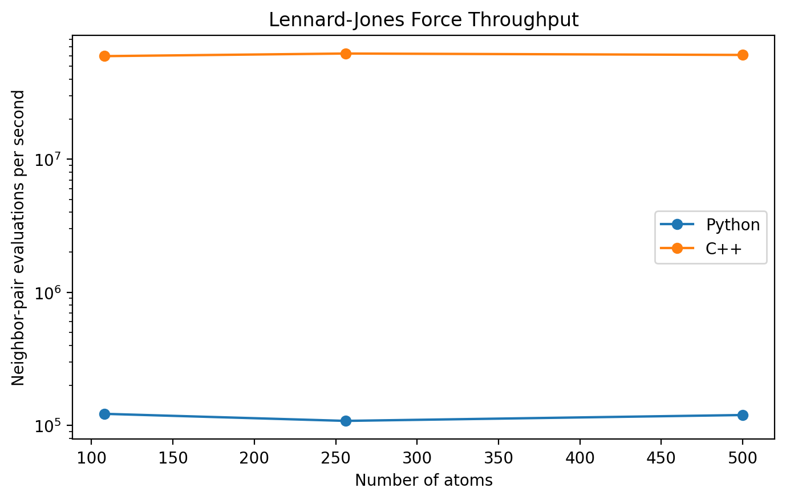
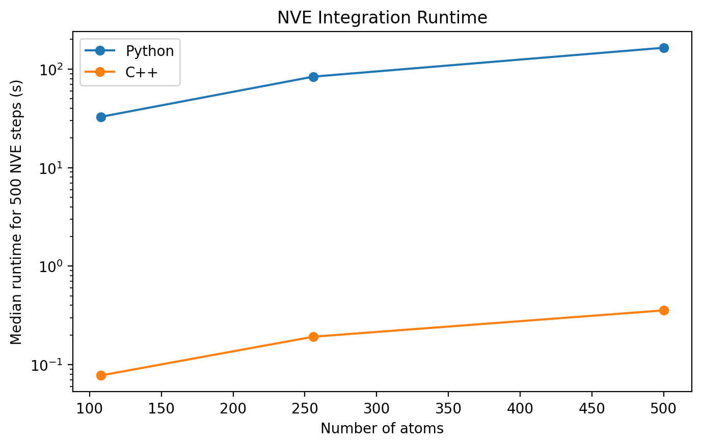
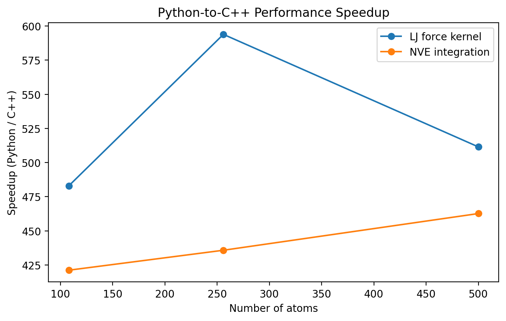
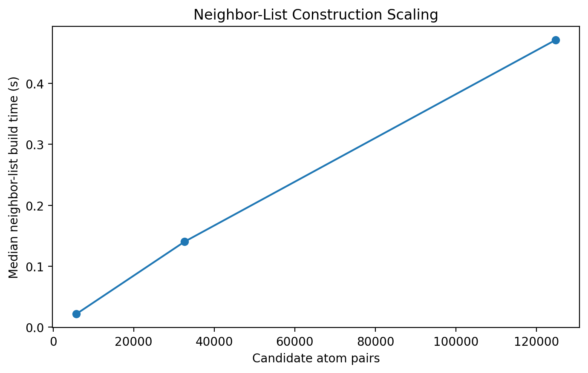

# FCC Molecular Dynamics Performance Report

## 1. Overview

This report evaluates the performance of the Python and C++/pybind11 backends in the FCC molecular dynamics code. The benchmarks are intended to measure computational performance rather than physical accuracy. Numerical agreement between the two backends is tested separately.

The benchmark suite measures three components:

1. Verlet neighbor-list construction.
2. Lennard-Jones force evaluation using an existing neighbor list.
3. Full NVE velocity-Verlet integration throughput.

The principal result is that the C++ backend substantially accelerates both the Lennard-Jones force kernel and the NVE integration loop relative to the Python backend. Across systems containing 108–500 atoms, the measured force-kernel speedup is approximately **483–594×**, while the measured NVE integration-loop speedup is approximately **421–463×**.

These speedups are specific to the Python and C++ implementations in this project and should not be interpreted as a general comparison between Python and C++, or as a comparison with optimized production MD packages.

---

## 2. Benchmark environment

The matched Python/C++ benchmarks were run on the same machine with the same simulation parameters.

| Parameter | Value |
|---|---|
| Operating system | Windows 11 |
| Python | 3.13.9 |
| Processor reported by Python | Intel64 Family 6 Model 140 Stepping 1, GenuineIntel |
| Logical CPU count | 8 |
| Material | Ni |
| Initial temperature | 300 K |
| Time step | 0.01 fs |
| Random seed | 123 |
| Thermal displacement | 0.01 Å |
| Steps per timed trajectory | 500 |
| Timed repetitions | 5 |
| Warmup | 2 |
| FCC sizes | 3×3×3, 4×4×4, 5×5×5 |
| Atom counts | 108, 256, 500 |

No OpenMP, MKL, or OpenBLAS thread-count environment variables were set in the recorded benchmark environment.

The integrator benchmark prepares independent copies of the initial state before timing, so system-copy/setup cost is excluded from the measured integration-loop runtime. Each timed repetition therefore measures the NVE stepping workload itself.

---

## 3. Benchmark methodology

### 3.1 Neighbor-list construction

The neighbor-list benchmark rebuilds the Verlet list from scratch. Both backends currently use the same Python neighbor-list implementation, so this measurement is not expected to show a backend speedup. Instead, it characterizes a remaining shared cost in the code.

### 3.2 Lennard-Jones force evaluation

The force benchmark evaluates the Lennard-Jones forces using an already constructed neighbor list.

For the Python backend, the Python force routine is called directly. For the C++ backend, the pybind11 force kernel is called with the same positions, box, force-field parameters, and neighbor pairs.

The benchmark reports force-call throughput and pair-evaluation throughput in addition to wall-clock time.

### 3.3 NVE integration

The integrator benchmark advances an independently copied system for a fixed number of velocity-Verlet steps. The timed region includes the normal stepping work, including backend force evaluation and neighbor-list update checks, but excludes initial system copying.

The principal comparison metric is

```math
S = \frac{t_{\mathrm{Python}}}{t_{\mathrm{C++}}},
```

where $t$ is the median runtime for an identical benchmark case.

Median runtime is used for the reported speedups because it is less sensitive to isolated timing fluctuations than the mean.

---

## 4. Numerical agreement

Performance measurements are only meaningful if the accelerated backend reproduces the reference implementation. The Python and C++ backends were therefore compared separately using automated regression tests.

The agreement tests verify:

- Lennard-Jones forces at identical positions and neighbor pairs.
- Potential energy and virial from the force calculation.
- Positions, velocities, forces, and energies after one NVE step.
- Agreement after a short 100-step trajectory.
- Correct behavior when particle motion triggers a Verlet neighbor-list rebuild.

The force-level comparison used tolerances near $10^{-12}$, the one-step comparison used tolerances near $10^{-11}$, and the short-trajectory comparison used tolerances near $10^{-8}$ to allow for accumulated floating-point roundoff. The complete pytest suite passed with the compiled C++ backend.

These tests establish that the performance comparison is between numerically consistent implementations of the same model and integration procedure.

---

## 5. Matched Python/C++ performance results

### 5.1 Lennard-Jones force kernel

| Atoms | Neighbor pairs | Python median time (ms) | C++ median time (ms) | Speedup |
|---:|---:|---:|---:|---:|
| 108 | 3,571 | 28.784 | 0.0596 | 483.0× |
| 256 | 10,001 | 94.545 | 0.1592 | 593.9× |
| 500 | 19,528 | 163.423 | 0.3195 | 511.5× |

The C++ force kernel reduces the cost of a force evaluation by roughly three orders of magnitude relative to the Python implementation. Across the tested sizes, the C++ kernel sustains approximately $6\times10^7$ pair evaluations per second, while the Python backend sustains approximately $1.1\times10^5$–$1.2\times10^5$ pair evaluations per second.



**Figure 1. Lennard-Jones force-evaluation throughput versus system size.** Throughput is reported as neighbor-pair evaluations per second for the Python and C++/pybind11 backends. The C++ implementation sustains approximately $6\times10^7$ pair evaluations per second across the tested sizes, compared with roughly $10^5$ pair evaluations per second for the Python implementation.

---

### 5.2 NVE integration

| Atoms | Python median, 500 steps (s) | C++ median, 500 steps (s) | Speedup |
|---:|---:|---:|---:|
| 108 | 32.765 | 0.0778 | 421.2× |
| 256 | 83.806 | 0.1923 | 435.8× |
| 500 | 164.543 | 0.3556 | 462.7× |

The C++ backend accelerates the complete timed NVE integration loop by approximately **421–463×** over the tested range. At 500 atoms, for example, the Python backend required about 164.5 s for 500 steps, while the C++ backend required about 0.356 s.

The corresponding C++ atom-step throughput remained approximately constant across these cases:

| Atoms | C++ atom-steps/s |
|---:|---:|
| 108 | 689,994 |
| 256 | 663,764 |
| 500 | 699,563 |

This relatively stable atom-step throughput is consistent with the cost of the compiled force kernel scaling approximately with the number of active neighbor pairs over the tested range.



**Figure 2. NVE integration runtime versus system size.** Median wall-clock time for 500 velocity-Verlet steps is shown for the Python and C++ backends using identical simulation parameters. A logarithmic vertical axis is used because the backend runtimes differ by more than two orders of magnitude.



**Figure 3. Python-to-C++ speedup versus system size.** Speedup is computed from the ratio of median Python to median C++ wall-clock times over five timed repetitions for identical Ni FCC configurations. The C++/pybind11 backend achieves approximately $483\text{–}594\times$ speedup for Lennard-Jones force evaluation and $421\text{–}463\times$ speedup for NVE integration over the tested system sizes.

---

## 6. Longer-run C++ throughput and neighbor-list rebuilding

A separate 256-atom C++ benchmark was run for 5,000 NVE steps per repetition to check whether the shorter 500-step benchmark was dominated by startup effects and to ensure that the trajectory exercised the neighbor-list rebuild path.

| Quantity | Result |
|---|---:|
| Atoms | 256 |
| Steps per repetition | 5,000 |
| Repetitions | 5 |
| Mean runtime | 2.048 s |
| Median runtime | 2.053 s |
| Runtime standard deviation | 0.027 s |
| Throughput | 2,442 steps/s |
| Atom-step throughput | 625,086 atom-steps/s |
| Mean neighbor-list rebuilds per trajectory | 1.0 |
| Rebuilds per 1,000 steps | 0.2 |

The earlier 500-step C++ benchmark at the same system size achieved approximately 2,593 steps/s. The 5,000-step run achieved approximately 2,442 steps/s, a difference of about 6%. The longer trajectory therefore retains similar throughput while also demonstrating that neighbor-list rebuilding occurs during the timed integration workload.

A standalone 256-atom neighbor-list build required approximately 0.12 s. Because the compiled force and integration kernels are now very fast, this shared Python neighbor-list implementation represents an increasingly important remaining cost.

---

## 7. Neighbor-list scaling and remaining bottleneck

The measured neighbor-list build times were:

| Atoms | Candidate pairs | Median build time (s) |
|---:|---:|---:|
| 108 | 5,778 | ~0.022 |
| 256 | 32,640 | ~0.12–0.14 |
| 500 | 124,750 | ~0.46–0.47 |

The current implementation checks candidate atom pairs in Python, so the work grows approximately with the number of possible pairs. This behavior becomes increasingly expensive as the system size grows.

After acceleration of the force and integration kernels, neighbor-list construction is therefore the clearest remaining performance bottleneck. A natural future optimization would be a cell-linked-list or other spatial-binning approach, potentially implemented in C++.



**Figure 4. Verlet neighbor-list construction scaling.** Median neighbor-list rebuild time is shown as a function of the number of candidate atom pairs. Because the current neighbor-list implementation examines candidate pairs in Python, the rebuild cost increases rapidly with system size and becomes a significant remaining bottleneck after acceleration of the force and integration kernels.

---

## 8. Interpretation

The benchmark results show that moving the computationally intensive molecular-dynamics kernels into C++ through pybind11 substantially changes the performance profile of the code.

The main observations are:

- The C++ Lennard-Jones force kernel is approximately **483–594× faster** than the Python force implementation over the tested systems.
- The C++ NVE integration loop is approximately **421–463× faster** than the Python backend.
- C++ force throughput is approximately $6\times10^7$ neighbor-pair evaluations per second over the tested sizes.
- The 5,000-step C++ test maintains similar throughput to the shorter benchmark and triggers a real neighbor-list rebuild.
- Numerical agreement tests confirm that the accelerated implementation reproduces the Python reference implementation to tight tolerances.
- Once the force and integration kernels are accelerated, Python neighbor-list construction becomes a significant remaining bottleneck.

These results demonstrate not only acceleration of an individual kernel but also a substantial improvement in the throughput of the complete NVE stepping loop.

---

## 9. Limitations

Several limitations should be kept in mind when interpreting these measurements.

First, the benchmark compares the specific Python and C++ implementations in this repository. The reported speedups should not be interpreted as representative of optimized Python approaches such as Numba, JAX, vectorized kernels, or production MD packages such as LAMMPS.

Second, the tested systems are relatively small by production molecular-dynamics standards. They are appropriate for profiling this educational/research code and for demonstrating backend scaling, but they do not establish large-scale HPC performance.

Third, neighbor-list construction remains implemented in Python and is shared between the two backends. Consequently, the current C++ backend is not yet an entirely compiled MD engine.

Finally, the 108-atom case is primarily useful as a small-system performance measurement. Because the box is small relative to the chosen cutoff, the 256- and 500-atom cases are more appropriate as the primary representative benchmark cases for the present configuration.

---

## 10. Reproducibility

Performance results are saved as JSON by the benchmark suite and include:

- simulation parameters,
- system size,
- backend,
- Python version,
- operating system,
- processor information reported by Python,
- repeat count,
- warmup count,
- timing statistics,
- neighbor-pair counts,
- integration throughput,
- and neighbor-list rebuild counts.

For comparisons, Python and C++ benchmarks should always be run with identical material parameters, timestep, random seed, system sizes, step counts, repeat counts, and thermal displacement.

---

## 11. Summary

For Ni FCC systems containing 108–500 atoms, the pybind11/C++ backend delivers approximately **421–463× higher NVE integration throughput** and **483–594× faster Lennard-Jones force evaluation** than the Python backend used in this project.

Backend-agreement tests pass at tight numerical tolerances, and a longer 5,000-step C++ trajectory confirms stable throughput while exercising the neighbor-list rebuild path. The benchmark therefore demonstrates both a large measured acceleration and numerical consistency with the Python reference implementation.

The principal remaining performance target is Verlet neighbor-list construction, which is still performed in Python and becomes increasingly important after acceleration of the force and integration kernels.
